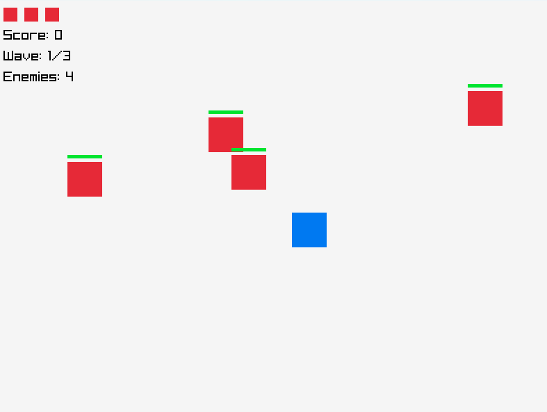

# Asteroids! Game Template

A simple game template built with C++ and raylib that provides the foundation for an asteroids-style game. This is a work-in-progress template with basic functionality implemented.



## Current Status

This is a **development template** that implements basic functionality:

- Simple player movement and attack mechanics
- Basic enemy spawning and behavior
- Collision detection between player attacks and enemies
- Game state management (menu, playing, paused, game over)
- Wave-based progression system

**Note:** This is not a complete game, but rather a starting point for your own game development.

## Directory Structure

```
.
├── CMakeLists.txt    # Build configuration file for CMake
├── src               # Source code directory
│   ├── game.h        # Header file for game classes
│   ├── game.cpp      # Implementation file for game classes
│   ├── main.cpp      # Main entry point for the game
│   └── assets/       # Game assets directory
│       └── screenshot.png # Development screenshot
└── .gitignore        # Git ignore file
```

## Getting Started

### Prerequisites

- CMake version 3.10 or higher
- A C++ compiler (e.g., g++, clang++)
- raylib (automatically downloaded by CMake if not found)

### Building the Project

1. Clone the repository:

   ```sh
   mkdir build
   cd build
   ```

2. Run CMake to configure the project:

   ```sh
   cmake ..
   ```

3. Build the project:

   ```sh
   make
   ```

   or

   ```sh
   cmake --build . --config Release
   ```

### Running the Project

After building, you can run the executable generated in the `build` directory:

   ```sh
   ./main
   ```

## Basic Controls

- **Movement**: WASD or Arrow Keys
- **Attack**: Spacebar
- **Pause**: P or ESC
- **Start/Restart**: Enter

## Code Overview

### Player Class

Manages player attributes and behaviors:

- Movement and screen boundary handling
- Attack mechanics
- Health system with temporary invulnerability

### Enemy Class

Handles enemy functionality:

- Movement patterns (currently simple bouncing)
- Health tracking
- Collision response

### Game Class

Controls the overall game logic:

- Game state management
- Enemy spawning
- Collision detection
- Wave progression

## Features

- Proper asteroid-style physics with momentum
- Ship rotation and directional movement

## Planned Improvements

- Better collision detection and response
- Proper graphics instead of primitive shapes
- Sound effects and music
- Particle effects for explosions and movement
- Power-ups and special abilities
- More enemy types with different behaviors
- A scoring and high-score system

## Contributing

Feel free to fork this repository and use it as a starting point for your own game. If you make improvements to the template itself, pull requests are welcome!

## License

This project is licensed under the MIT License.
